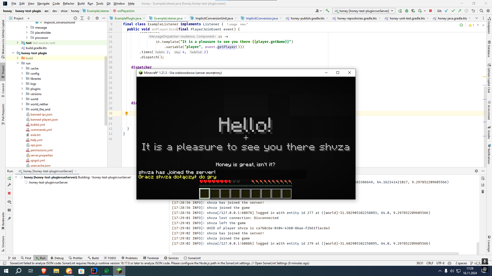

## honey (*miód*)

A message library, which focuses on simplicity and flexibility.

### Intent

*honey* was created to allow for developers to create easily customizable messages for end users, by giving them flexibility with placeholders.

### Get started

#### Gradle DSL (kts) || std

##### Add repository

```kotlin
maven("https://repo.shiza.dev/releases")
```

```groovy
maven { url 'https://repo.shiza.dev/releases' }
```

##### Add dependency

```kotlin
implementation("dev.shiza:honey:2.0.1")
```

```groovy
implementation 'dev.shiza:honey:2.0.1'
```

#### Maven

##### Add repository
```xml
<repository>
  <id>shiza-releases</id>
  <url>https://repo.shiza.dev/releases</url>
</repository>
```

##### Add dependency
```xml
<dependency>
  <groupId>dev.shiza</groupId>
  <artifactId>honey</artifactId>
  <version>2.0.1</version>
</dependency>
```



### Use case (honey)

A showcase of how to use *honey*, can be found in [honey-test-plugin](honey-test-plugin) module.

#### With use of formatter

*MessageFormatter* provides all functionality that honey offers, it comes with reflective placeholder
evaluation and sanitization to make them harmless, while used with minimessage without any additional
hasle on developer side.

```java
AdventureMessageDispatcher.createTitle()
    .recipient(event.getPlayer())
    .title(it -> it.template(formatter, "Hello!"))
    .subtitle(it -> it.template(formatter, "It is a pleasure to see you there {{player.getName}}"))
    .variable("player", event.getPlayer())
    .times(2, 4, 2)
    .dispatch();

AdventureMessageDispatcher.createChat()
    .recipient(Bukkit.getServer())
    .template(formatter, "{{player.getName}} has joined the server!")
    .variable("player", event.getPlayer())
    .dispatch();

AdventureMessageDispatcher.createActionBar()
    .recipient(event.getPlayer())
    .template(formatter, "Honey is great, isn't it?")
    .dispatch();
```

#### Without formatter

*MessageDispatcher* provides a way to send messages without the need of using placeholders.

```java
AdventureMessageDispatcher.createChat()
    .recipient(Bukkit.getServer())
    .template(Component.text("Somebody joined to the server!").color(NamedTextColor.RED))
    .dispatch();

AdventureMessageDispatcher.createActionBar()
    .recipient(event.getPlayer())
    .template(Component.text("Honey is great, isn't it?"))
    .dispatch();
```

### Use case (honey-kt-extesion)
```kotlin
AdventureMessageDispatcher.createChat()
    .recipient(event.player)
    .template(Component.text("Hello!"))
    .dispatch()

AdventureMessageDispatcher.createActionBar()
    .recipient(event.player)
    .template(Component.text("This is an action bar message!"))
    .dispatch()

player.createChat()
    .template(Component.text("A custom chat message"))
    .dispatch()

player.createActionBar()
    .template(Component.text("This is a custom action bar"))
    .dispatch()

AdventureMessageDispatcher.createTitle()
    .recipient(event.player)
    .title { it.template(Component.text("Hello!")) }
    .subtitle { it.template(Component.text("It's great to see you!")) }
    .times(2, 4, 2)
    .dispatch()
```

### Synchronous vs asynchronous message dispatching
- [dispatch](https://github.com/rchomczyk/honey/tree/main/honey-common/src/dev/shiza/honey/message/dispatcher/MessageBaseDispatcher.java#L71)
  This method immediately delivers the message synchronously. It calls the deliver function with the rendered message and the recipient, and the action is completed immediately.

- [dispatchAsync](https://github.com/rchomczyk/honey/tree/main/honey-common/src/dev/shiza/honey/message/dispatcher/MessageBaseDispatcher.java#L76)
  This method delivers the message asynchronously. It returns a CompletableFuture that performs the message rendering in the background and then delivers the result once it's ready. It allows non-blocking behavior and handles exceptions asynchronously.